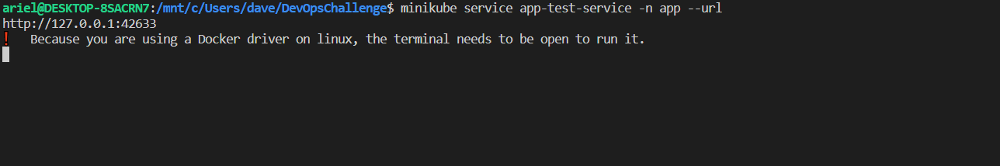
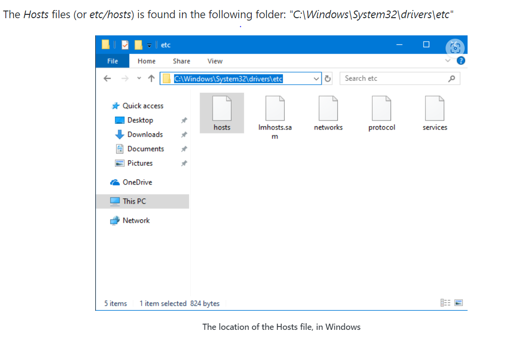
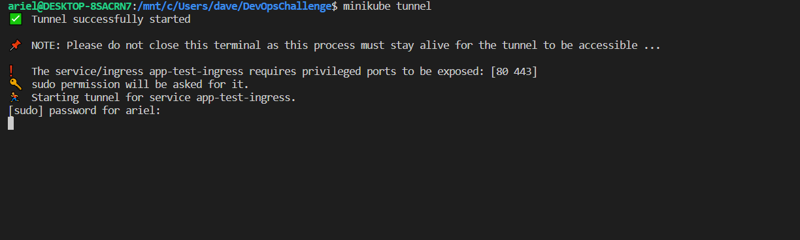
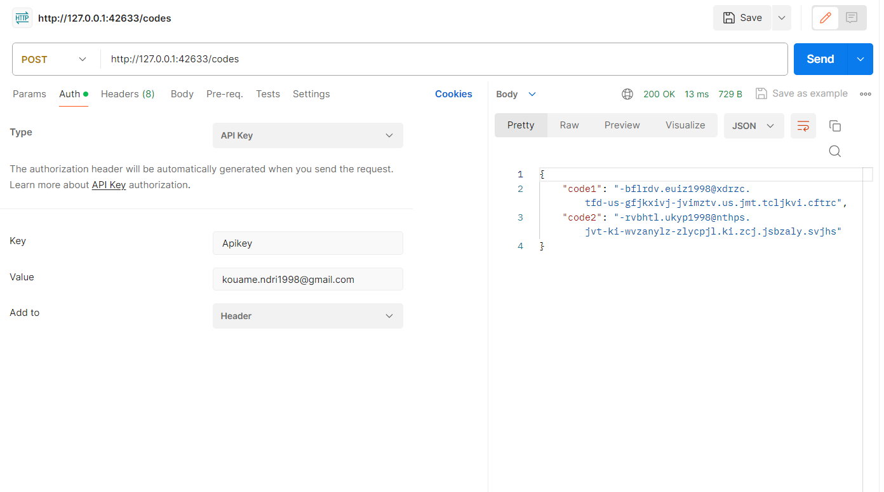
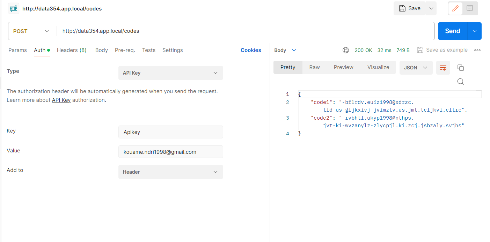
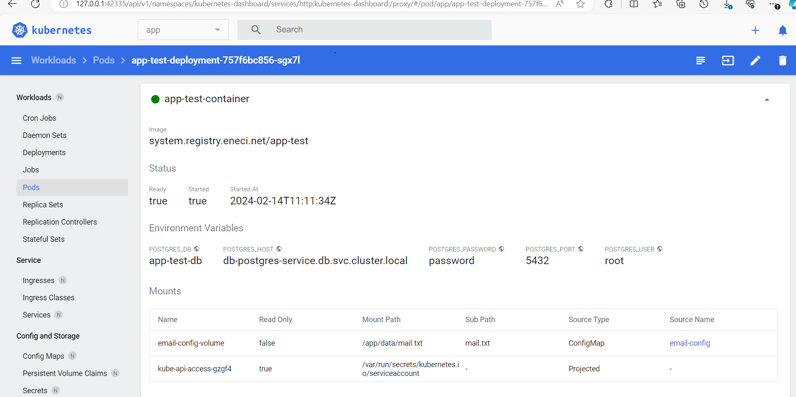
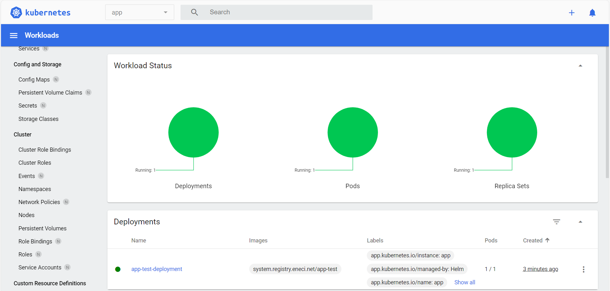
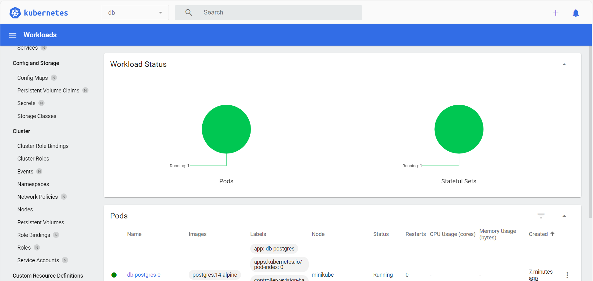

# data354-devOps-challenge

## Architecture


## Description

 The application must communicate with a Postgres database as described in the architecture.
 The goal of this project is to retrieve the validations codes that are migrated from the app-test to the database.
 The codes can only be retrieved by **POST** request on the endpoint **/codes**.

### **Tasks**

 1. Deploy a Kubernetes cluster
 2. Create the different namespaces (**app**,**db**)
 3. Create the diferents manifests (Deployment for app-test in app namespace and Statefulset for the database in db namespace)
 4. Update the file **/app/data/email.txt** inside the app Pod container with a custom email (for example: <example@gmail.com>)
 5. Retrieve the validations codes by a **POST** request on **/codes** with required credential specified in the header as
   {Apikey: <example@gmail.com>}
  
## Prerequisites

Before you begin, ensure you have met the following requirements:

- [Minikube](https://minikube.sigs.k8s.io/docs/start/) installed
- [Helm](https://helm.sh/docs/intro/install/) installed and initialized
- Docker installed [docker](https://docs.docker.com/engine/install/)
- kubectl [kubectl](https://kubernetes.io/docs/tasks/tools/install-kubectl-linux/) installed

## Tasks execution

1. ### Creating kubernets cluster from local environment
  
  In order to deploy a local kubernetes cluster we use minikube which a developer friendly tool to build and deploy  local Kubernetes cluster. The command below sets up a local Kubernetes cluster on macOS, Linux, and Windows.
  
  ```bash
# you should specify the driver in case you're using a diferent driver than Docker.
 minikube start 
 ```

#### **The output should look like**

 

2. ### Creating namespaces (**app** and **db**)

   ```bash
   kubectl create namespace app
   kubectl create namespace db
   ```


1. ### app-test and deployment using respectively Deployment and Statefulset

  In order to build a shareable  and scalable yaml file code we adopted Helm, a package manager for kubernetes project.
  we generated two Helm chart each one of our apps (**app** and **db** )

  ```bash
  #create helm chart for db manifest
  helm create db --namespace=db

  #create helm chart for app manifest
  helm create app --namespace=app
  ```

 app chart creating

 db chart creating


default helm chart code structure


1. ### creating secret to pull contianer image from private repository  

   ```bash
   kubectl create secret docker-registry app-secret --docker-username=<yourUsername> --docker-password=<yourPassword> --docker-server=https://<serverDomain> --namespace=app
 
   ```


1. ### method used to update **/app/data/mail.txt** file inside the container

   We mounted a volume from the host machine to the container virtual machine by creating a kubernetes configMap component in the app chart. here the sample code used.
   <code>
   #app/templates/email-config-map.yaml
   #the file /secrets/mail.txt contains my email address
    apiVersion: v1
    kind: ConfigMap
    metadata:
      name: email-config
      namespace: {{.Values.namespace}}
    data:
      {{ (tpl (.Files.Glob "secrets/mail.txt").AsConfig . ) | indent 2 }} # generate configMap from a file.

</code>
  
  3. Deployments

We updated the default helm chart in both app folder and db folder and deployed the manifests using:

```bash
#from the root directory of our repository we run. 

#deploying db statefulset with its service component 
helm install db ./db --namespace=db

#deploying app-test Deployment with its service and ingress components

helm install app ./app --namespace=app

```


list all charts in app namespace

```bash
helm list --namespace=app
```


list all charts in db namespace

```bash
helm list --namespace=db
```

 

 1. Accessing the app from host machine

#### method 1:  invoking the service of the app-test pod using minikube

   ```bash
   #run this command 
   minikube service app-test-service -n app --url
```


we can access the app through the generate url <http://127.0.0.1:42633>.

#### method 2:  invoking the service through an ingress component of the app-test pod using minikube

 We appended 127.0.0.1 data354.app.local in  /etc/hosts file from our host machine.
 the location of that file on windows machine is as shown in the picture :


   ```bash
   #run this command 
   minikube tunnel 
   ```


We can now access the app through the url : <http://data354.app.local>
5. code retrieving request on **/codes**

#### method 1

 

#### method  2



## Getting Started

To run the cluster localy from your computer you should follow these steps:

### Installation

1. Clone the repository:

   ```bash
   git clone https://github.com/NdriAriel/data354-devOps-challenge.git
   cd data354-devOps-challenge
   ```

2. start your minikube cluster

   ```bash
   minikube start
   ```

3. create **db** and **app** namespaces

 ```bash
 kubectl create namespace db
 kubectl create namespace app

 ```

 4. deployments

   ```bash
   #from the root of the repo run:
   helm install app ./app -n app
   helm install db ./db -n db

   ```

5. Accessing the app

#### first method

  ```bash
   minikube serive app-test-service -n app --url 
  ```

  now you can access the app from the generated **url**

#### second method

  Append **127.0.0.1 data354.app.local** in your /etc/hosts file from  your computer and run the following command.
  
  ```bash
  minikube tunnel
  ```

  after that you should be able to request the app from <http://data354.app.local>

## minikube dashboard ui screenshots

 1. app-test container
   
 2. app  Pod state
  
3. db Pod state
   