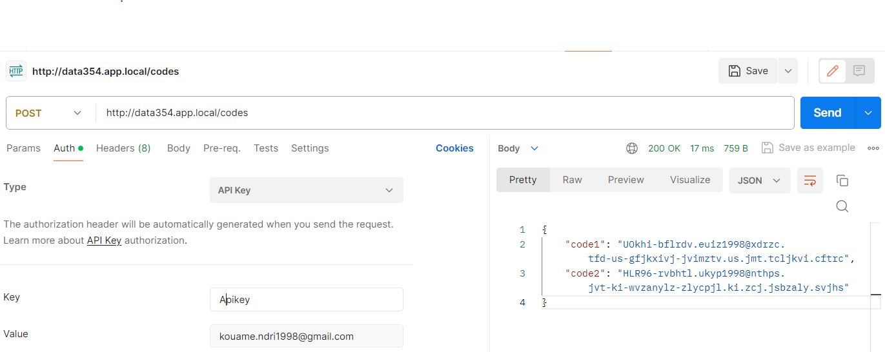

# Project Name

Short description of the project.

## Table of Contents

- [Project Name](#project-name)
  - [Table of Contents](#table-of-contents)
  - [Prerequisites](#prerequisites)
  - [Getting Started](#getting-started)
    - [Installation](#installation)
- [data354-devOps-challenge](#data354-devops-challenge)

## Prerequisites

Before you begin, ensure you have met the following requirements:

- [Minikube](https://minikube.sigs.k8s.io/docs/start/) installed and configured
- [Helm](https://helm.sh/docs/intro/install/) installed and initialized
- Docker installed (if you are building custom Docker images)

## Getting Started

To get a local development environment up and running, follow these steps:

### Installation

1. Clone the repository:

   ```bash
   git clone https://github.com/your/repository.git
   cd repository

# data354-devOps-challenge

