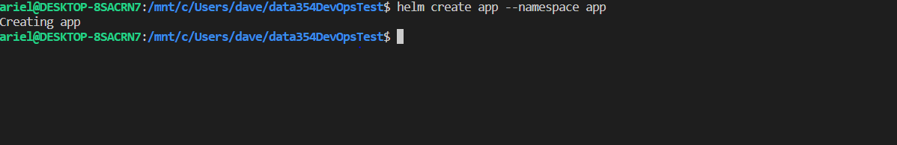
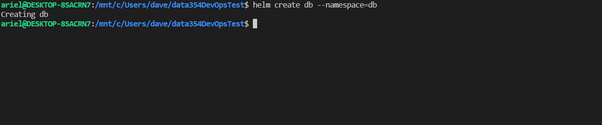
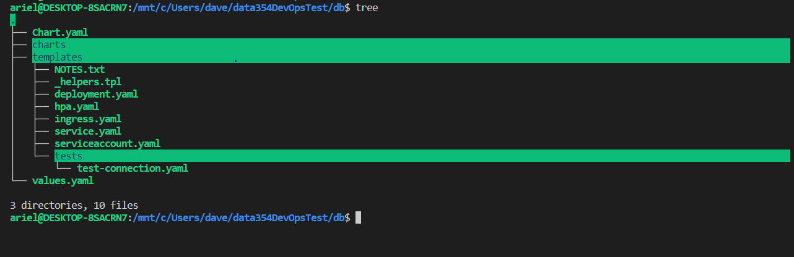
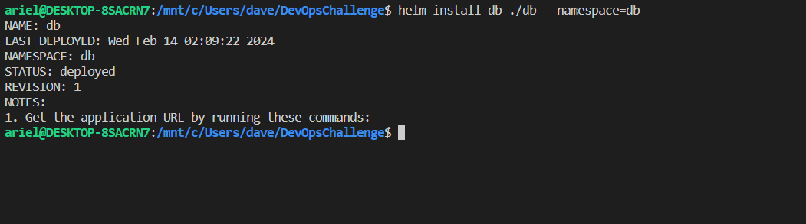
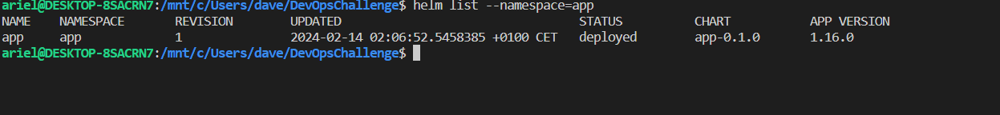
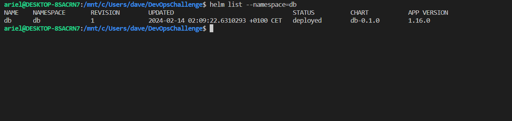

# data354-devOps-challenge

## Architecture


## Description

 The application must communicate with a Postgres database as described in the architecture.
 The goal of this project is to retrieve the validations codes that are migrated from the app-test to the database.
 The codes can only be retrieved by **POST** request on the endpoint **/codes**.

### **Tasks**

 1. Deploy a Kubernetes cluster
 2. Create the different namespaces (**app**,**db**)
 3. Create the diferents manifests (Deployment for app-test in app namespace and Statefulset for the database in db namespace)
 4. Update the file **/app/data/email.txt** inside the app Pod container with a custom email (for example: <example@gmail.com>)
 5. Retrieve the validations codes by a **POST** request on **/codes** with required credential specified in the header as
   {Apikey: <example@gmail.com>}
  
## Prerequisites

Before you begin, ensure you have met the following requirements:

- [Minikube](https://minikube.sigs.k8s.io/docs/start/) installed
- [Helm](https://helm.sh/docs/intro/install/) installed and initialized
- Docker installed [docker](https://docs.docker.com/engine/install/)
- kubectl [kubectl](https://kubernetes.io/docs/tasks/tools/install-kubectl-linux/) installed

## Results

1. ### Creating kubernets cluster from local environment
  
  In order to deploy a local kubernetes cluster we use minikube which a developer friendly tool to build and deploy  local Kubernetes cluster. The command below sets up a local Kubernetes cluster on macOS, Linux, and Windows.
  
  ```bash
# you should specify the driver in case you're using a diferent driver than Docker.
 minikube start 
 ```

#### **The output should look like**

 

2. ### Creating namespaces (**app** and **db**)

   ```bash
   kubectl create namespace app
   kubectl create namespace db
   ```

#### **The output should look like**


3. ### app-test and deployment using respectively Deployment and Statefulset

  In order to build a shareable  and scalable yaml file code we adopted Helm, a package manager for kubernetes project.
  we generated two Helm chart each one of our apps (**app** and **db** )

  ```bash
  #create helm chart for db manifest
  helm create db --namespace=db

  #create helm chart for app manifest
  helm create app --namespace=app
  ```

### **output**

 app chart creating

 db chart creating


default helm chart code structure


1. ### creating secret to pull contianer image from private repository  

   ```bash
   kubectl create secret docker-registry app-secret --docker-username=<yourUsername> --docker-password=<yourPassword> --docker-server=https://<serverDomain> --namespace=app
 
   ```

### output


We updated the default helm chart in both app folder and db folder and deployed the manifests using:
```bash 
#from the root directory of our repository we run. 

#deploying db statefulset with its service component 
helm install db ./db --namespace=db

#deploying app-test Deployment with its service and ingress components

helm install app ./app --namespace=app

```
### **outputs**



list all charts in app namespace 
```bash
helm list --namespace=app
```


list all charts in db namespace
```bash
helm list --namespace=db
```
 
## Getting Started

To get a local development environment up and running, follow these steps:

### Installation

1. Clone the repository:

   ```bash
   git clone https://github.com/NdriAriel/data354-devOps-challenge.git
   cd data354-devOps-challenge
