# data354-devOps-challenge

## Architecture

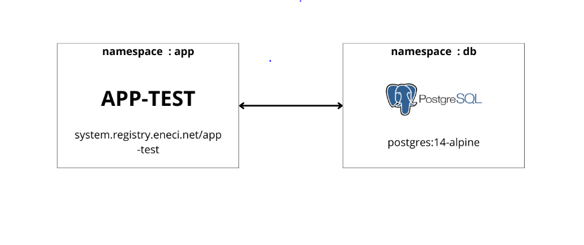

## Description

 The application must communicate with a Postgres database as described in the architecture.
 The goal of this project is to retrieve the validations codes that are migrated from the app-test to the database.
 The codes can only be retrieved by **POST** request on the endpoint **/codes**.

### **Tasks**

 1. Deploy a Kubernetes cluster
 2. Create the different namespaces (**app**,**db**)
 3. Create the diferents manifests (Deployment for app-test in app namespace and Statefulset for the database in db namespace)
 4. Update the file **/app/data/email.txt** inside the app Pod container with a custom email (for example: <example@gmail.com>)
 5. Retrieve the validations codes by a **POST** request on **/codes** with required credential specified in the header as
   {Apikey: <example@gmail.com>}
  
## Prerequisites

Before you begin, ensure you have met the following requirements:

- [Minikube](https://minikube.sigs.k8s.io/docs/start/) installed
- [Helm](https://helm.sh/docs/intro/install/) installed and initialized
- Docker installed [docker](https://docs.docker.com/engine/install/)
- kubectl [kubectl](https://kubernetes.io/docs/tasks/tools/install-kubectl-linux/) installed

## Results

 1. Creating kubernets cluster from local environment.

#### After installing the required softwares for this project, we generated a kubernetes cluster by running this command

  ```bash
# you should specify the driver in case you're using a diferent driver than Docker.
 minikube start 
 ```

#### **The output should look like**

 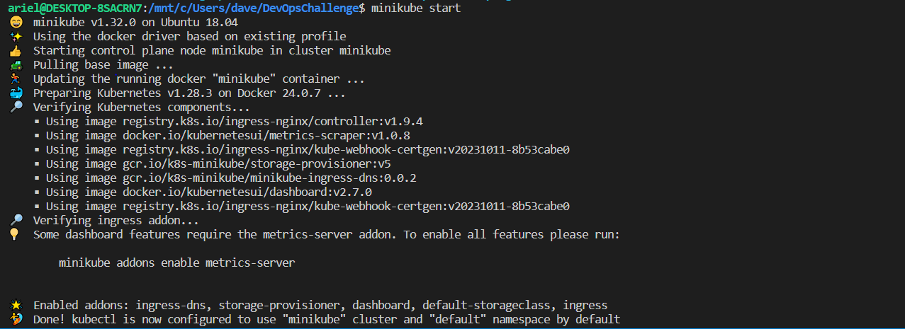

 2. Creating namespaces (**app** and **db**)

   ```bash
   kubectl create namespace app
   kubectl create namespace db
   ```
#### **The output should look like**

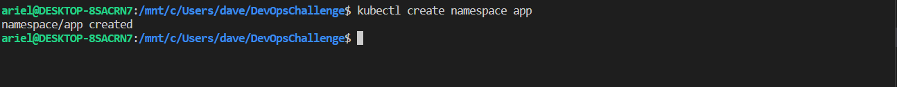


## Getting Started

To get a local development environment up and running, follow these steps:

### Installation

1. Clone the repository:

   ```bash
   git clone https://github.com/NdriAriel/data354-devOps-challenge.git
   cd data354-devOps-challenge

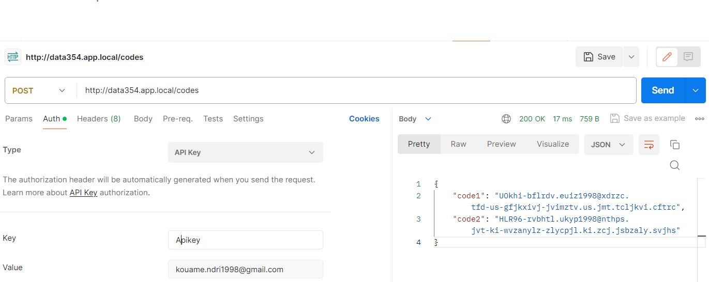

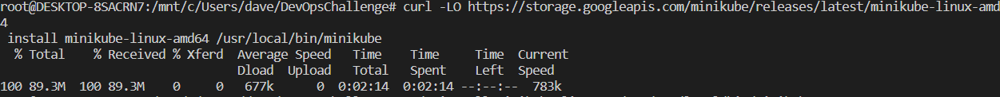

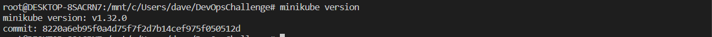

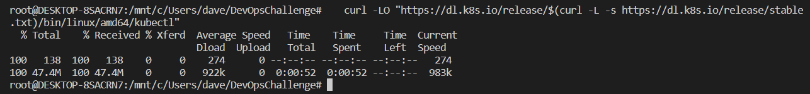

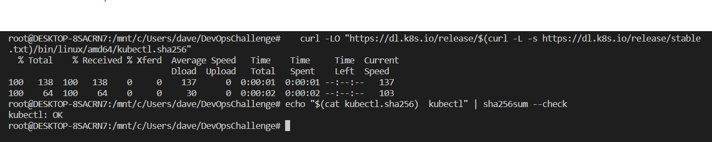

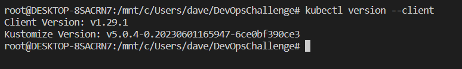

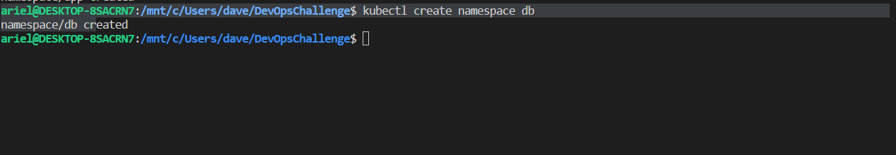

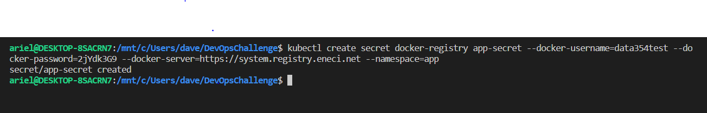
